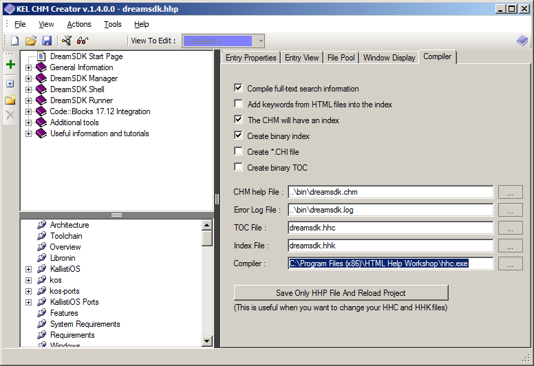
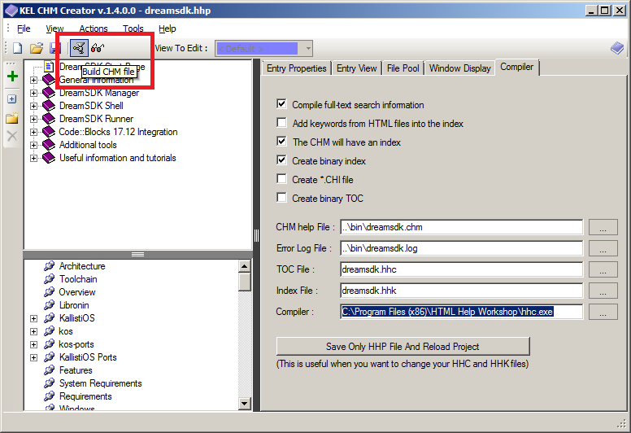
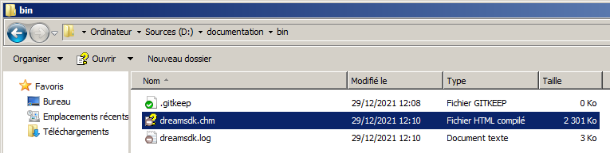

# DreamSDK Help #

This repository contains the **DreamSDK** documentation.

The documentation is produced in 2 differents formats:

* In [Microsoft Compiled HTML Help](https://en.wikipedia.org/wiki/Microsoft_Compiled_HTML_Help) (`CHM` file);
* [Directly available online](https://www.dreamsdk.org/help/).

The `CHM` file will be embedded in the DreamSDK package, and can be viewed even
offline. Of course, the online version available on the website can be only
read if you have an internet connection, which is not the case for the `CHM`
file.

## How to produce the CHM file ##

You need to install first the 2 utilities provided in the `utils` directory:

1. [Microsoft HTML Help Workshop](https://docs.microsoft.com/en-us/answers/questions/265752/htmlhelp-workshop-download-for-chm-compiler-instal.html)
2. [KEL CHM Creator](https://dumah7.wordpress.com/2009/02/17/kel-chm-creator-v-1-4-0-0/)

Please install `htmlhelp.exe` (1) then `KEL_CHM_Creator_Setup.msi` (2).

Then you can double-click on the `src/dreamsdk.hhp` file. **KEL CHM Creator**
should start.

In **KEL CHM Creator** you'll need to specify the location of the `hhc`
executable, usually installed in `C:\Program Files (x86)\HTML Help Workshop\hhc.exe`
on a 64-bit system.

Then when everything is ready, you can click on `Build CHM file`.

The `dreamsdk.chm` file will be generated in the `./bin` directory.

The `dreamsdk.chm` file will be embedded in the **DreamSDK Setup** using the
`prepare` script, please browse the `setup-helpers` repository for more
information on that part.

